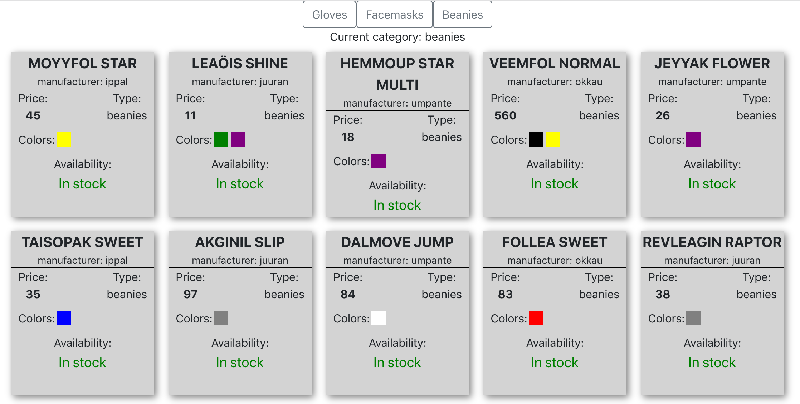
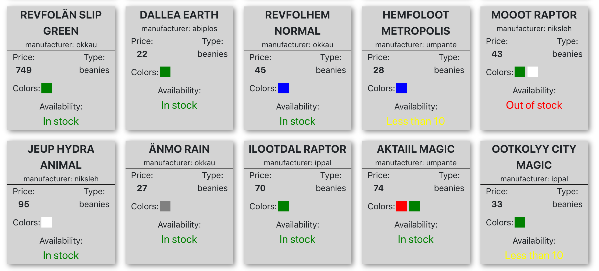

# Dashboard for clothing brand warehouses

# Working version
[`http://35.228.81.77`](http://35.228.81.77)

### Table of Contents
* [Used Versions](#used-versions)
* [User Interface](#user-interface)
* [Algorithm of work](#algorithm-of-work)
* [Problems & Further Improvements](#problems--further-improvements)
* [Testing](#testing)

### Used Versions
I've used [React](https://reactjs.org/) as a frontend framework.

* React: 17.0.1
* Node.js: v12.19.0
* npm: 6.14.8

### User Interface

User chooses one of the category and web-application provides the list of products from selected category.


It takes some time to receive the data, while that "Waiting for the information" will be shown in Availability section of the product.

After receiving information about quantity of the products, application updates it. There are three possible values: In stock, Less than 10, Out of stock.



### Algorithm of Work
Application loads the information about products from a certain category.
The structure of receiving data from first API:
```
[
    {
        id: String,
        type: String,
        name: String,
        color: [
            String
        ],
        price: Number,
        manufacturer: String
    },
    ...
]
```
Next, the application finds all manufacturers for the certain category and requests the information about availability of the products from second API.
The structure of receiving data from second API:
```
[
    {
        id: String,
        DATAPAYLOAD: String
    },
    ...
]
```
After that, application updates information about availability of the products.
Switching between product categories occurs by choosing a category at the top of the screen.

### Testing
Versions of web browsers used to test the application.
* Firefox: 86.0
* Google Chrome: 88.0.4324.192 
* Safari: 13.1.2 

### Problems & Further Improvements
* Application loads every time information about the products from APIs. This information could be managed and updated by special backend service to reduce time for displaying products.
* Errors are just caught and not displayed to the user. More fancy way of informing could be added.